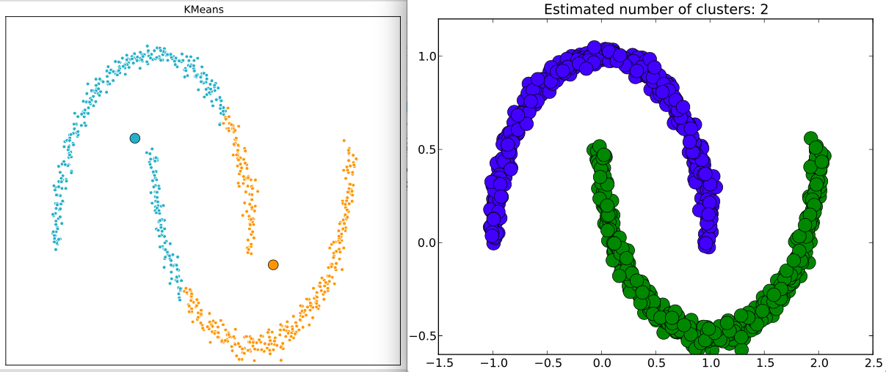
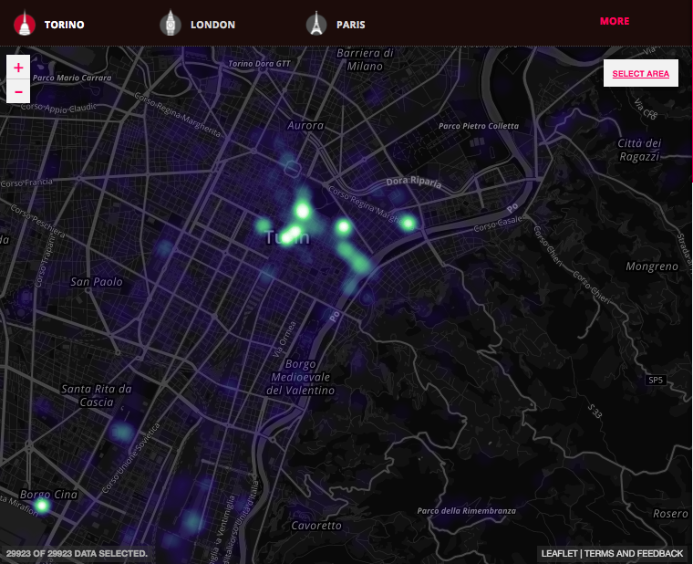

### DBSCAN 
(**D**ensity **B**ased **S**patial **C**lustering of **A**pplications with **N**oise)  
**Clustering basado en densidad (1996)** 

#### .- Clustering:  
**Objetivo:** Encontrar grupos de instancias tales que las instancias en un cluster sean similares entre sí, y diferentes de las instancias en otros clusters, donde se Minimiza la distancia Intra-Cluster y Maximiza la distancia Inter-Cluster. 
Para esto, la mejor definición de cluster depende de la naturaleza de los datos y los resultados deseados.

#### .- DBSCAN
**¿En qué consiste?**  
Tiene un enfoque basado en la densidad, modelando los clusters como cúmulos de alta densidad de puntos. Por lo cual, si un punto pertenece a un clúster, debe estar cerca de un montón de otros puntos de dicho clúster.
Se basa en el concepto de densidad de un punto, que mide el número de puntos que son alcanzables desde él considerando un determinado radio.  
Un cluster en una región densa de puntos, separada por regiones poco densas de otras regiones densas. 

**¿Cómo funciona?**  
Se definen dos parámetros, un número **épsilon** (**_Eps_**) positivo y un número natural **minPoints** (**_MinPts_**), y se elige un punto arbitrario **_x_** en el conjunto de datos. Si **_x_** es un punto central (_core points_), se empieza a construir un cluster alrededor de él, tratando de descubrir componentes denso-conectadas. A continuación se elige un nuevo punto arbitrario (**_y_**) y se repite el proceso el cual termina cuando no se pueden añadir nuevos puntos a ningún clúster.  
_Vecindad_ de un punto **_x_**: esfera centrada en **_x_** y radio **_Eps_**  
_Densidad_ de un punto **_x_**: cantidad de puntos dentro de la vecindad de **_x_**.  

>   

_Puntos centrales_ (_core points_) son aquellos tales que en su vecindad de radio **_Eps_**, hay una cantidad de puntos mayor o igual que un umbral **_MinPts_** especificado. Son los puntos interiores de un cluster.  
Un punto _borde_ o _frontera_ tiene menos puntos que **_MinPts_** en su vecindad, pero pertenece a la vecindad de un punto central.  
Un _punto ruido_ (_noise_) es aquel que no es ni central ni borde.  

En consecuencia, los _puntos centrales_ están en regiones de alta densidad, los _puntos borde_ en la frontera de regiones densas y los _puntos ruido_ en regiones de baja densidad. Este algoritmo busca clusters comprobando la vecindad de cada punto de la base de datos y va añadiendo puntos que son denso-alcanzables desde un punto
central.   

Un punto **_q_** es directamente denso-alcanzable desde otro punto **_t_** (con relación a los parámetros **_MinPts_** y **_Eps_**) si **_t_**  es un punto central y **_q_**  pertenece a la vecindad de **_t_**. Un punto **_q_**  es denso-alcanzable desde un punto **_t_** si existe una cadena de puntos **$t_0$**, **$t_1$,... $t_m$**, tales que **$t_{i-1}$** es directamente denso-alcanzable desde **$t_i$**, 1 ≤ i ≤ m, **$t_0$** **= q** y **$t_m$** **= t**.  

En los puntos de un mismo cluster, su k-ésimo vecino debería estar más o menos a la misma distancia.
En los puntos de ruido, su k-ésimo vecino debería estar más lejos.

> Datos originales vs Cluster DBSCAN:
> 
>  
> En esta imagen podemos ver cómo quedaría un agrupamiento luego de utilizar DBSCAN.     

---  

#### Comparación con otros modelos:

> K-Means vs DBSCAN:  
> 
>  
> Con K-Means vemos que los clusters quedan formados por puntos de ambas curvas, mientras que con DBSCAN se pueden separar fácilmente ambas regiones en grupos distintos.  

---  

#### Fortalezas
* Encuentra clusters no separables linealmente.
* Identifican clusters de formas arbitrarias.
* No necesita asumir un número fijo de clusters (No hay qye especificar k).
* No depende de las condiciones de inicio.
* Robusto ante la presencia de ruido.
* Es de una sola pasada.  

#### Debilidades
* Asume densidades similares en todos los clusters.
* Puede tener problemas al separar clusters.
* Elegir Eps y MinPts puede requerir tener conocimiento de los datos, y puede ser dificil en casos de alta dimensionalidad.
* No es bueno para datos de alta dimensionalidad, grupos de diferentes densidades y grupos muy solapados.

---  

#### Ejemplo:

**Fuente:**
http://www.datainterfaces.org/projects/flickr/#torino  
(_La descarga de los datos se realizó haciendo uso de técncias básicas de web scraping_)  

> 

**¿Qué es Flickr?**  
Flickr es una plataforma digital, propiedad de Yahoo, que permite guardar, buscar y compartir fotografías y videos en Internet. Servicios similares incluyen a plataformas como Instagrama o Pinterest.  

En un esfuerzo por abrir sus datos al público Flickr, en conjunto con YahooLabs, crearon el Flickr cities. El proyecto consiste el desarrollo de una interface exploratoria de millones de imágenes que se han compartido mediante la plataforma en distintas ciudades, que se mapean en una interface visual (un mapa). Dentro de los metadatos de cada fotografía podemos encontrar el lugar, la fecha, el tema, la nacionalidad del usuario y la hora.   

Lo anterior nos permite contar con información valiosa de los patrones y hábitos que desarrollan los turistas de cierta nacionalidad a cierta hora del día.

**¿Cómo se usará la base de datos y el DBSCAN?**  
El proyecto de Flickr cities cuenta con información de ciudades como París, Londres, Tokio, Buenos Aires o Torino. Para este ejercicio se utilizarán los datos de Torino por ser de un tamaño razonable comparado con ciudades más grandes y con mayor volumen de turistas.  

Dado que el el algoritmo de DBSCAN se base en la densidad de datos principalmente, entendemos que en la ciudad existirán lugares con grandes cantidades de fotografías que denominaremos como lugares de interés general. Por ejemplo, pudiésemos encontrar monumentos históricos, museos, iglesias, estadios de fútbol, universidades, parques públicos entre otros.  
Consideraremos como _ruido_ a las fotograífas espontáneas que se toman en cualquier punto de la ciudad.  
Básicamente, eliminando el "ruido" esperamos encontrar clústers identificados por el algoritmo cerca de lugares de interés general. 

```{r warning=FALSE, message=FALSE}
library(tidyverse)
library(dbscan)
```

#### Datos de Torino:
```{r}
torino <- read.csv("clean_points_torino_full.csv")
DT::datatable(head(torino[,2:7], 10), escape = FALSE,
              caption = htmltools::tags$caption(style = 'caption-side: bottom; text-align: center;',
                                                'Table: ', htmltools::em('Torino - Fotos')))

```

**Graficamos curva para determinar _Eps_**  
Con la gráfica de codo podemos determinar el valor del _Eps_ (radio) optimo para cierta cantidad de puntos:
```{r}
df_torino <- torino[2:3]
kNNdistplot(df_torino, k = 200)
abline(h=0.01, col = "red", lty=2)
```


**Aplicamos DBSCAN y visualizamos los clústers obtenidos**  
Los parámetros definidos son:  
_eps_ = 0.01   
_minPts_ = 200  
```{r}
res <- dbscan(df_torino, eps = 0.01, minPts = 200)
res
```

Obtenemos la cantidad de clústers y la cantidad de puntos considerados como _ruido_ (clúster 0).

**Graficamos clústers**
```{r}
df_torino$cluster <- res$cluster
ggplot(df_torino, aes(x=longitude, y=latitude, colour=factor(df_torino$cluster))) +
  geom_point()
```


```{r}
hullplot(df_torino[1:2], res)
```


---  

#### Comparación de clustering con K-Means:
Definimos la misma cantidad de grupos obtenidos con DBSCAN. **k = 10**
```{r}
df_torino_KM <- torino[2:3]
df_torino_KM$cluster <- kmeans(df_torino_KM, centers=10, nstart=25)$cluster
ggplot(df_torino_KM, aes(x=longitude, y=latitude, colour=factor(cluster))) + 
  geom_point()
```

> En éste caso, al armar los clústers con K-Means vemos todos los puntos (imagenes) forman parte de algún grupo, donde tambien se consideran las fotos espontáneas las cuales no corresponden a algún sitio de interés general.

---  

#### Regresando al agrupamiento realizado con DBSCAN, tomamos los puntos del clúster mas grande:
```{r}
df_centro <- df_torino %>% 
  filter(cluster == 2)
```


**Graficamos curva para determinar _Eps_**
```{r}
kNNdistplot(df_centro[1:2], k = 100)
abline(h=0.0025, col = "blue", lty=2)
```


**Aplicamos DBSCAN y visualizamos los clústers obtenidos**
```{r}
res <- dbscan(df_centro[1:2], eps = 0.0025, minPts = 100)
res
```

**Graficamos clústers**
```{r}
df_centro$cluster <- res$cluster
ggplot(df_centro, aes(x=longitude, y=latitude, colour=factor(df_centro$cluster))) +
  geom_point()
```


```{r}
hullplot(df_centro[1:2], res)
```


#### Graficamos los puntos de cada clúster en un mapa:
```{r eval=FALSE}
library(leaflet)

pchIcons = function(pch = 1, width = 30, height = 30, bg = "transparent", col = NULL, ...) {
  n = length(pch)
  files = character(n)
  # create a sequence of png images
  for (i in seq_len(n)) {
    f = tempfile(fileext = '.png')
    png(f, width = width, height = height, bg = bg)
    par(mar = c(0, 0, 0, 0))
    plot.new()
    points(.5, .5, pch = pch[i], col = col[i], cex = min(width, height) / 8, ...)
    dev.off()
    files[i] = f
  }
  files
}

leaflet(df_centro)%>% addTiles() %>%
  addMarkers(
    data = df_centro,
    icon = ~ icons(
      iconUrl = pchIcons(pch= cluster,width=40,height=40,col=cluster,lwd=4),
      popupAnchorX = 20, popupAnchorY = 0
    ))
```

(_Para la presentación estamos utiliando una imagen del mapa obtenido. Si se habilita el código anterior puede desplegarse el mismo._)

> 
>    
> Al eliminar el ruido podemos identificar los sitios de interes, los cuales pueden coincidir con: parques, estadios, estaciones de trenes, universidades, sitios turísticos, fábricas, etc.  

---  

#### .- Aplicaciones:
Algunas de las aplicaciones de DBSCAN realizadas con exito son: la deteccion de usos en las tierras a partir de imagenes satelite, la creacion de perfiles de usuarios en Internet mediante la agrupacion de sesiones Web, o el agrupamiento de bases de datos de imagenes en histogramas en color facilitando la busqueda de imagenes similares


> Detección del uso del terreno para distintos años:  
> 

---  

#### Segmentación de imagenes:  
> Secciones de un embrión:  
> 
> 
> Imagenes satelitales:  
> Por ej. permite indentificar el porcentaje de concreto en una sección de la ciudad, así mismo también se puede realizar una aproximación sobre la cantidad de casas con techo de laminado o el porcentaje de calles pavimentadas, etc.
>
> 

---  

> Clustering con diferentes algoritmos:
> 

---  

#### .- Librerías:
* Python: sklearn.cluster DBSCAN  
* R: dbscan  

#### .- Otros algoritmos:
* OPTICS: Ordering Points To Identify the Clustering Structure (Ankerst et al. SIGMOD’1999)
* DENCLUE: DENsity-based CLUstEring (Hinneburg & Keim, KDD’1998)
* CLIQUE: Clustering in QUEst (Agrawal et al., SIGMOD’1998)
* SNN (Shared Nearest Neighbor) density-based clustering (Ertöz, Steinbach & Kumar, SDM’2003)

---  